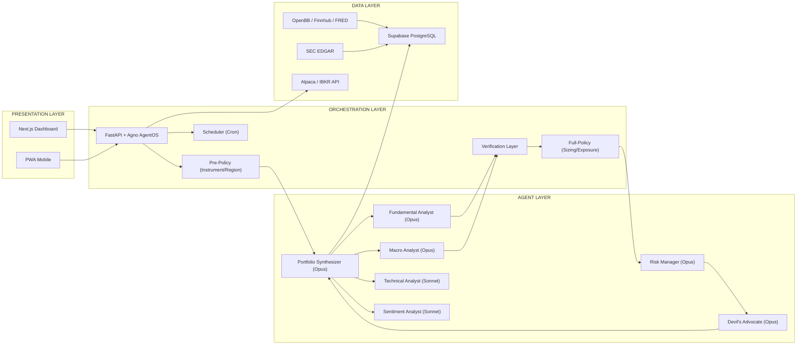

# System-Übersicht — MyTrade

> **Quelle:** Architektur-Spezifikation v2.1, Sektionen 1, 3, 4, 5

---

## 1. Executive Summary

MyTrade ist eine KI-gestützte Investment-Plattform, die Research, Fundamentalanalyse, Risikobewertung, Portfolio-Management und Trade-Execution mit Claude Opus als zentralem Reasoning-Layer automatisiert. Spezialisierte KI-Agenten übernehmen die gesamte Analyse-Kette — der menschliche Investor trifft die finale Entscheidung.

### Design-Prinzipien

1. **Fokussierte API-Calls:** Jeder Agent bekommt nur den Kontext, den er braucht (~70K Token auf 6 Calls verteilt statt 500K+ in einem Kontext).
2. **State in Datenbank:** Alle Investment-Regeln, Portfolio-State und Analyse-Historie leben in PostgreSQL, nicht im LLM-Kontext.
3. **Human-in-the-Loop:** Kein Trade ohne expliziten menschlichen Klick. Keine Ausnahmen.
4. **Verification-First:** Jede KI-generierte Zahl wird automatisch gegen unabhängige Primärquellen geprüft (Tier A/B/C).
5. **Policy Engine:** Deterministische Code-Prüfung in zwei Stufen: **Pre-Policy** VOR dem Agent-Call (blockt verbotene Instrumente/Regionen), **Full-Policy** NACH Verification (prüft Sizing/Exposure auf verifizierten Zahlen). Siehe @docs/05_risk/policy-engine.md.
6. **Gradueller Reifegrad:** System startet bei Stufe 0 (nur Memos) und graduiert über Monate zu Stufe 2 (Confirm-Button).

---

## 2. Geschäftsprozess-Architektur

Das System löst ein Geschäftsproblem in drei Ebenen:

### Ebene A: Research (Input sammeln und verdichten)
- News, SEC-Filings, Earnings Reports, Makrodaten einsammeln
- Noise filtern: Was ist passiert, was ist wichtig, was ist irrelevant?
- Quellenliste für jede Aussage (Herkunft + Zeitstempel)
- **Ergebnis:** Strukturierte Datenbasis für Analyse

### Ebene B: Analyse und Risiko (Denken)
- Fundamentalanalyse: Geschäftsmodell, Finanzen, Bewertung, Qualität
- Technische Analyse: Trend, Support/Resistance, Indikatoren
- Sentiment: News-Stimmung, Insider-Trades, Analyst-Consensus
- Makro-Kontext: Marktregime, Sektor-Outlook, Geopolitik
- Risk Assessment: IPS-Compliance, Positionsgröße, Portfolio-Korrelation
- Devil's Advocate: Systematische Zerstörung der Investment-These
- **Ergebnis:** Investment Note mit Empfehlung + Confidence Score

### Ebene C: Entscheidung und Execution (Handeln)
- Konkreter Trade-Plan: Instrument, Größe, Ordertyp, Stop-Loss, Exit-Kriterien
- Policy-Gate: Deterministische Prüfung gegen IPS-Regeln (kein LLM)
- Human Approval: User reviewt Investment Note und bestätigt oder verwirft
- Execution: Order via Broker API (Paper oder Live je nach Reife-Stufe)
- Logging: Warum wurde der Trade gemacht? Vollständiger Audit Trail

---

## 3. Vier Architektur-Layer



| Layer | Komponenten | Funktion |
|-------|-------------|----------|
| 1. Präsentation | Next.js Web-App + PWA Mobile | Dashboard, Portfolio-Übersicht, Analyse-Cards, Approval-Buttons, Alerts |
| 2. Orchestrierung | FastAPI + Agno AgentOS + Policy Engine + Verification Layer + Scheduler | Agent-Koordination, Workflow-Steuerung, IPS-Enforcement, Daten-Verification, Cron-Jobs |
| 3. Agenten | 7 spezialisierte Claude-Agenten (4x Opus, 3x Sonnet) | Makro, Fundamental, Technik, Sentiment, Risk, Devil's Advocate, Synthese |
| 4. Daten | Supabase + OpenBB + Finnhub + FRED + EDGAR + Broker APIs | Portfolio-State, Finanzdaten, Marktdaten, Filings, Trade-Execution |

---

## 4. Kontextfenster-Strategie

> **Kern-Innovation:** Statt alles in ein Kontextfenster zu laden, macht jeder Agent einen fokussierten API-Call mit nur seinem relevanten Kontext. Eine vollständige Analyse verbraucht ~70.000 Token verteilt auf 6 fokussierte Calls statt 500.000+ Token in einem einzigen Kontext. Das ist präziser, billiger und skalierbar.

| Agent | Token-Budget | LLM | Input | Output |
|-------|-------------|-----|-------|--------|
| Data Collector | 0 (kein LLM) | — | API-Calls | JSON in DB |
| Macro Analyst | ~15K | Opus | Makro-Indikatoren | Markt-Regime + Sektoren |
| Fundamental | ~30K | Opus | Bilanz, GuV, Cashflow, Peers | Bewertung + Scores |
| Technical | ~10K | Sonnet | Preisdaten + Indikatoren | Signal + Levels |
| Sentiment | ~8K | Sonnet | News + Insider + Ratings | Score (-100 bis +100) |
| Risk Manager | ~12K | Opus | Alle Outputs + IPS + Portfolio | Risiko + Position Size |
| Devil's Advocate | ~15K | Opus | These + Risiken | Gegenargumente |
| Synthesizer | ~10K | Opus | Komprimierte Outputs | Investment Note |

---

## 5. Tech-Stack

| Layer | Technologie | Begründung |
|-------|-------------|------------|
| Agent-Framework | Agno | Native Claude-Support, built-in FastAPI (AgentOS), PostgreSQL-Integration, coordinate-Mode |
| LLM (Reasoning) | Claude Opus 4.6 | #1 Finance Agent Benchmark. Für Fundamentalanalyse, Risk, Devil's Advocate, Synthese |
| LLM (Quick Tasks) | Claude Sonnet 4.5 | ~5x günstiger. Für Technical Analysis, Sentiment, Daten-Formatierung |
| Backend / API | FastAPI (Python) | KI-Backend-Standard. Agno liefert AgentOS als built-in FastAPI-App. Async-native |
| Datenbank | Supabase (PostgreSQL) | RLS, Realtime, Auth, Edge Functions. Agno-native PostgreSQL-Integration |
| Frontend | Next.js + React + Tailwind + shadcn/ui | AI-nativer Frontend-Stack. SSR, Chart-Libraries. PWA-fähig |
| Daten-Layer | Finnhub + Alpha Vantage + FRED + SEC EDGAR | Finnhub Echtzeit (60/Min free). FRED für Makro. EDGAR für Filings |
| Broker (Paper) | Alpaca API | Paper Trading Mode. Nur US-Aktien/ETFs |
| Broker (Global) | Interactive Brokers (IBKR) | Für europäische Märkte, globale Abdeckung (ab Stufe 2) |
| Hosting | Railway + Vercel | Railway für Python-Backend. Vercel für Next.js. EU-Server für GDPR |

### Mobile Nutzung
Next.js + Tailwind ist von Grund auf responsive. Als PWA (Progressive Web App) lässt sich die Web-App auf dem Homescreen installieren, unterstützt Push-Notifications und funktioniert offline für gecachte Daten. Trade-Approvals sind vom Handy möglich.

---

## 6. Deployment-Architektur

```
┌─────────────┐     ┌──────────────────┐     ┌─────────────────┐
│   Vercel     │────▶│   Railway         │────▶│   Supabase      │
│  (Frontend)  │     │  (Backend/API)    │     │  (PostgreSQL)   │
│  Next.js     │     │  FastAPI + Agno   │     │  EU Region      │
│  CDN Global  │     │  EU Region        │     │  RLS Active     │
└─────────────┘     └──────────────────┘     └─────────────────┘
                           │
                    ┌──────┴───────┐
                    ▼              ▼
              ┌──────────┐  ┌──────────┐
              │ Finnhub  │  │ Alpaca   │
              │ Alpha V. │  │ Paper    │
              │ FRED     │  │ Trading  │
              │ SEC EDGAR│  │          │
              └──────────┘  └──────────┘
```

---

## Referenzen
- Build Brief: @docs/00_build-brief/brief.md
- Policy Engine: @docs/05_risk/policy-engine.md
- Execution Contract: @docs/05_risk/execution-contract.md
- Datenprovider: @docs/06_data/providers.md
- Agent-Spezifikationen: @docs/03_architecture/agents.md
- Datenbank-Schema: @docs/03_architecture/database-schema.md
